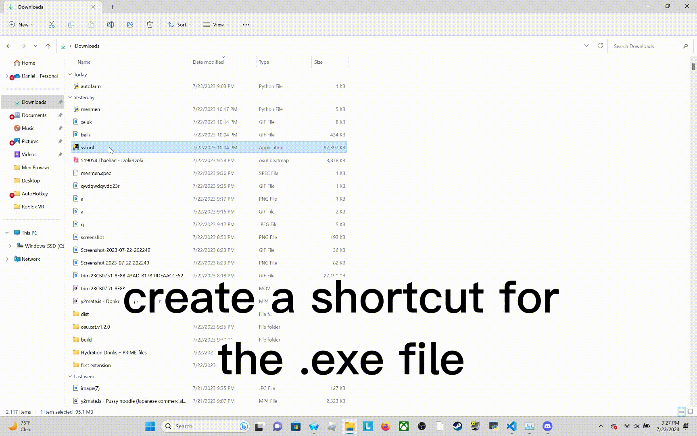

# sstool
not making this open source yet because it actually took me time to make, but i might soon. you can download it at this page: https://github.com/immayr/sstool/releases/tag/v1 (sstool.exe)
# startup
<h3>use the steps below to learn how to make sstool a startup app on your pc 
</h3>
Step 1: Make a shortcut for the .exe file 
Step 2: Press Windows + R on your keyboard to open up the run menu 
Step 3: Type in "shell:startup" and press enter on your keyboard 
Step 4: Drag the shortcut that you made into the folder that opened when you hit enter 

<h3>or follow along with the gif below to make sstool a startup app 

